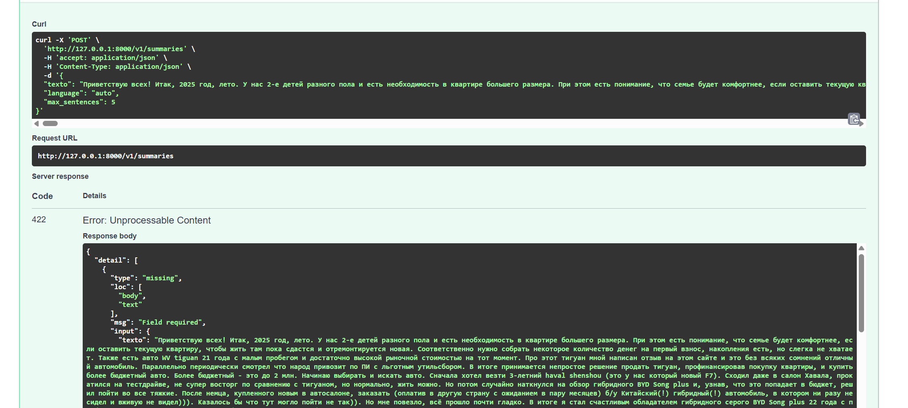
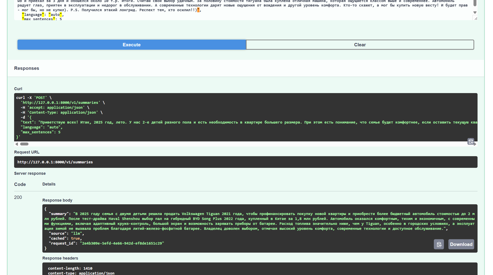

# LLM Summarizer

[](https://github.com/baibakovkir/ai-netology-final/actions/workflows/ci.yml)

HTTP-сервис суммаризации русского и английского текста через любой API, совместимый с
OpenAI Chat Completions. Проект демонстрирует разделение API, бизнес-логики и LLM-клиента,
обработку отказов, TTL-кеш, безопасную конфигурацию, тесты и CI.

## Как работает сервис

```text
POST /v1/summaries
        │
        ├── валидация запроса
        ├── проверка TTL-кеша
        ├── формирование system + user prompt
        ├── LLM-запрос с таймаутами и ретраями
        ├── очистка и проверка ответа
        └── 200 + LLM summary
                 или
            503 + локальный fallback
```

Fallback — первые содержательные предложения исходного текста. Он не кешируется, поэтому
следующий запрос снова попробует обратиться к модели. In-memory кеш действует только внутри
одного процесса и очищается при перезапуске.

Сервис не логирует API-ключ и полный пользовательский текст. Для корреляции событий используется
`X-Request-ID`, переданный клиентом или созданный сервером.

## Быстрый запуск с Docker

Требуются Docker и Docker Compose.

```bash
cp .env.example .env
# Укажите APP_LLM_API_KEY и при необходимости URL/модель в .env
docker compose up --build
```

API будет доступен на <http://localhost:8000>, Swagger UI — на
<http://localhost:8000/docs>. Healthcheck не обращается к внешней модели:

```bash
curl http://localhost:8000/health
```

Без API-ключа сервис также запускается, но запрос суммаризации намеренно вернет `503` с fallback.

## Локальный запуск

Используйте Python 3.12+:

```bash
python3 -m venv .venv
source .venv/bin/activate
python -m pip install -e '.[dev]'
cp .env.example .env
uvicorn llm_summarizer.main:app --reload
```

## API

### `POST /v1/summaries`

Поля запроса:

| Поле | Тип | Ограничения | По умолчанию |
|---|---|---|---|
| `text` | string | 50–20 000 символов после нормализации | обязательное |
| `language` | string | `auto`, `ru`, `en` | `auto` |
| `max_sentences` | integer | 1–10 | 5 |

При `language=auto` резюме сохраняет язык исходного текста.

```bash
curl -i http://localhost:8000/v1/summaries \
  -H 'Content-Type: application/json' \
  -H 'X-Request-ID: demo-001' \
  -d '{
    "text": "Большой исходный текст должен содержать не менее пятидесяти символов. Сервис выделит его основные мысли и вернет короткое резюме.",
    "language": "ru",
    "max_sentences": 2
  }'
```

Успешный ответ (`200`):

```json
{
  "summary": "Сервис выделяет основные мысли длинного текста и возвращает краткое резюме.",
  "source": "llm",
  "cached": false,
  "request_id": "demo-001"
}
```

Если LLM недоступна после ретраев, структура сохраняется, но возвращается `503`:

```json
{
  "summary": "Большой исходный текст должен содержать не менее пятидесяти символов.",
  "source": "fallback",
  "cached": false,
  "request_id": "demo-001"
}
```

Невалидные данные возвращают стандартный структурированный ответ FastAPI со статусом `422`.

### `GET /health`

Возвращает `200 {"status":"ok"}` и показывает, что процесс API готов принимать запросы.

## Конфигурация

Все переменные имеют префикс `APP_`; полный шаблон находится в `.env.example`.

| Переменная | Назначение |
|---|---|
| `APP_ENVIRONMENT` | профиль `dev` или `prod` |
| `APP_LOG_LEVEL` | уровень структурированных JSON-логов |
| `APP_LLM_BASE_URL` | базовый URL с версией API, например `.../v1` |
| `APP_LLM_API_KEY` | секретный ключ, никогда не коммитится |
| `APP_LLM_MODEL` | имя модели провайдера |
| `APP_LLM_CONNECT_TIMEOUT_SECONDS` | таймаут соединения |
| `APP_LLM_READ_TIMEOUT_SECONDS` | таймаут чтения ответа |
| `APP_LLM_RETRIES` | число повторов после первого вызова, 0–5 |
| `APP_LLM_RETRY_BACKOFF_SECONDS` | базовая задержка между повторами |
| `APP_CACHE_TTL_SECONDS` | время жизни успешного ответа |
| `APP_CACHE_MAX_ENTRIES` | максимальное число записей кеша |
| `APP_PROMPT_VERSION` | версия промпта, включенная в cache key |

Ретраи выполняются для сетевых ошибок, таймаутов, HTTP 429 и 5xx. Ошибки авторизации и
некорректный формат ответа не ретраятся.

## Разработка и проверки

```bash
ruff check .
ruff format --check .
pytest
python -m build
```

GitHub Actions выполняет эти проверки и дополнительно собирает Docker-образ на каждый push и
Pull Request. Подробные ручные сценарии находятся в [TESTING.md](TESTING.md).

## Демонстрация

Успешный ответ модели (`200`, `source=llm`):


Ошибка валидации (`422`):



Повторный запрос использует кеш (`cached=true`):



## Структура

```text
src/llm_summarizer/  API, конфигурация, LLM-клиент и бизнес-логика
tests/               unit- и API-тесты без реального LLM-вызова
.github/             CI и шаблон Pull Request
Dockerfile           multi-stage production image
compose.yaml         локальный запуск и healthcheck
```
